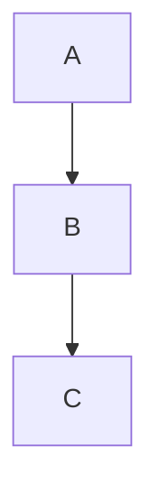

# Contribuindo com o Projeto

## Objetivo

Embora este repositório tenha sido desenvolvido como parte de um desafio acadêmico da Pós-Graduação em IA Generativa e Prompt Engineering, sua estrutura foi organizada seguindo boas práticas de projetos Open Source.

Este documento descreve os padrões utilizados durante o desenvolvimento e estabelece diretrizes para futuras contribuições.

---

# Organização do Projeto

O projeto está dividido em módulos independentes.

```text
prompt-engineering-frameworks/

README.md

frameworks.md

framework-comparison.md

decision-tree.md

lessons-learned.md

references.md

questao-01/
questao-02/
...
questao-08/
```

Cada questão representa um estudo independente.

---

# Estrutura das Questões

Todas as questões seguem exatamente a mesma organização.

```text
questao-XX/

README.md

prompt.md

modelo.md

output.md

justificativa.md
```

A padronização facilita a manutenção e a navegação pelo repositório.

---

# Convenções Utilizadas

## Markdown

Todos os documentos devem ser escritos utilizando Markdown compatível com GitHub.

---

## Títulos

Utilizar sempre:

```markdown
# Título Principal

## Seção

### Subseção
```

---

## Tabelas

Preferir tabelas para comparações.

Exemplo:

| Item | Descrição |
|------|-----------|
| Framework | R-T-F |

---

## Diagramas

Sempre que possível utilizar Mermaid.

Exemplo:



---

## Blocos de Código

Sempre identificar a linguagem.

Exemplo:

````markdown
```bash
docker build -t app .
```
