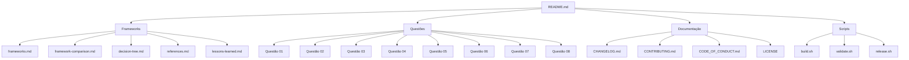
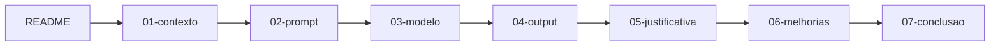

# 🧭 Guia de Navegação do Projeto

## Objetivo

Este documento tem como objetivo orientar a navegação pelo repositório **Prompt Engineering Frameworks**, apresentando a organização dos arquivos, a finalidade de cada documento e a ordem recomendada de leitura.

A estrutura foi planejada para proporcionar uma experiência de navegação simples, organizada e semelhante à documentação encontrada em projetos Open Source.

---

# Estrutura Geral do Repositório

O projeto está organizado em cinco grandes grupos:

- Documentação principal
- Frameworks de Prompt Engineering
- Resolução das atividades
- Documentação de apoio
- Scripts de automação

A estrutura completa é apresentada abaixo.

```text
frameworks-prompt-engineering/

├── README.md
├── NAVIGATION.md
├── frameworks.md
├── framework-comparison.md
├── decision-tree.md
├── lessons-learned.md
├── references.md
│
├── questao-01/
├── questao-02/
├── questao-03/
├── questao-04/
├── questao-05/
├── questao-06/
├── questao-07/
├── questao-08/
│
├── assets/
│
├── build.sh
├── validate.sh
├── release.sh
│
├── CHANGELOG.md
├── CONTRIBUTING.md
├── CODE_OF_CONDUCT.md
├── LICENSE
│
└── dist/
```
---

## 🏗️ Arquitetura do Projeto

O diagrama abaixo apresenta a organização lógica do repositório e a relação entre seus principais componentes.

```mermaid
flowchart TB

ROOT["🚀 Prompt Engineering Frameworks"]

%% =========================
%% Documentação Principal
%% =========================

ROOT --> DOC["📚 Documentação Principal"]

DOC --> README["README.md<br/>Apresentação do Projeto"]
DOC --> NAV["NAVIGATION.md<br/>Guia de Navegação"]
DOC --> FRAME["frameworks.md<br/>Frameworks"]
DOC --> COMP["framework-comparison.md<br/>Comparação"]
DOC --> TREE["decision-tree.md<br/>Árvore de Decisão"]
DOC --> LESSON["lessons-learned.md<br/>Lições Aprendidas"]
DOC --> REF["references.md<br/>Referências"]

%% =========================
%% Questões
%% =========================

ROOT --> QUEST["📝 Questões Desenvolvidas"]

QUEST --> Q1["Questão 01"]
QUEST --> Q2["Questão 02"]
QUEST --> Q3["Questão 03"]
QUEST --> Q4["Questão 04"]
QUEST --> Q5["Questão 05"]
QUEST --> Q6["Questão 06"]
QUEST --> Q7["Questão 07"]
QUEST --> Q8["Questão 08"]

%% Estrutura Interna

Q1 --> STRUCT["Estrutura Padronizada"]

STRUCT --> C1["01-contexto.md"]
STRUCT --> C2["02-prompt.md"]
STRUCT --> C3["03-modelo.md"]
STRUCT --> C4["04-output.md"]
STRUCT --> C5["05-justificativa.md"]
STRUCT --> C6["06-melhorias.md"]
STRUCT --> C7["07-conclusao.md"]

%% =========================
%% Assets
%% =========================

ROOT --> ASSETS["🎨 Assets"]

ASSETS --> SVG["banner.svg"]
ASSETS --> MMD["Diagramas Mermaid"]

%% =========================
%% Scripts
%% =========================

ROOT --> SCRIPT["⚙️ Scripts"]

SCRIPT --> BUILD["build.sh"]
SCRIPT --> VALIDATE["validate.sh"]
SCRIPT --> RELEASE["release.sh"]

%% =========================
%% Governança
%% =========================

ROOT --> GOV["📋 Governança"]

GOV --> LICENSE["LICENSE"]
GOV --> CHANGELOG["CHANGELOG.md"]
GOV --> CONTRIB["CONTRIBUTING.md"]
GOV --> COC["CODE_OF_CONDUCT.md"]

%% =========================
%% Distribuição
%% =========================

ROOT --> DIST["📦 Distribuição"]

DIST --> TAR["dist/<br/>prompt-engineering-frameworks-v1.0.0.tar.gz"]
```


---

## 🔄 Ciclo de Desenvolvimento do Projeto

```mermaid
flowchart LR

A["📖 Estudo dos Frameworks"]

A --> B["📝 Construção do Prompt"]

B --> C["🤖 Escolha do Modelo de IA"]

C --> D["⚙️ Geração do Output"]

D --> E["📚 Documentação"]

E --> F["💡 Sugestões de Melhoria"]

F --> G["✅ Conclusão"]

G --> H["📦 Build do Projeto"]

H --> I["🚀 Entrega Final"]
```


---

# Ordem Recomendada de Leitura

A leitura sugerida foi organizada para facilitar o entendimento gradual do projeto.

## Etapa 1 — Conhecendo o Projeto

Leia inicialmente os documentos que apresentam a visão geral do trabalho.

| Documento | Objetivo |
|-----------|----------|
| README.md | Apresentação geral do projeto |
| frameworks.md | Explicação dos frameworks estudados |
| framework-comparison.md | Comparação entre os frameworks |
| decision-tree.md | Guia para escolha do framework adequado |
| references.md | Referências bibliográficas utilizadas |
| lessons-learned.md | Lições aprendidas durante o desenvolvimento |

---

## Etapa 2 — Resolução das Questões

Após compreender os conceitos, recomenda-se a leitura das oito atividades desenvolvidas.

Cada questão está organizada de forma padronizada.

```
Questão XX

↓

README

↓

01-contexto

↓

02-prompt

↓

03-modelo

↓

04-output

↓

05-justificativa

↓

06-melhorias

↓

07-conclusao
```

Essa organização permite compreender toda a evolução da solução, desde o contexto inicial até as sugestões de melhoria identificadas ao final da atividade.

---

## Etapa 3 — Documentação do Projeto

Os documentos abaixo apresentam informações relacionadas à manutenção do repositório.

| Documento | Finalidade |
|-----------|------------|
| CHANGELOG.md | Histórico de alterações |
| CONTRIBUTING.md | Diretrizes para contribuição |
| CODE_OF_CONDUCT.md | Código de conduta |
| LICENSE | Licença do projeto |

---

## Etapa 4 — Scripts

O projeto também possui scripts auxiliares para automação.

| Script | Objetivo |
|---------|----------|
| build.sh | Geração do pacote de distribuição |
| validate.sh | Validação da estrutura do projeto |
| release.sh | Preparação de novas versões |

---

# Estrutura Interna das Questões

Todas as questões seguem exatamente a mesma estrutura.

| Arquivo | Finalidade |
|----------|------------|
| README.md | Visão geral da atividade |
| 01-contexto.md | Contexto do problema |
| 02-prompt.md | Prompt elaborado |
| 03-modelo.md | Modelo de IA utilizado |
| 04-output.md | Resultado produzido |
| 05-justificativa.md | Justificativa da escolha do framework |
| 06-melhorias.md | Sugestões de evolução da solução |
| 07-conclusao.md | Considerações finais da atividade |

---

# Fluxo de Navegação do Projeto



---

# Fluxo de Navegação de Cada Questão



---

# Roteiro de Leitura por Perfil

O projeto pode ser explorado de diferentes formas, conforme o interesse do leitor.

| Perfil | Ordem Recomendada |
|---------|-------------------|
| Professor | README → Frameworks → Comparação → Árvore de Decisão → Questões → Lições Aprendidas |
| Estudante | README → Frameworks → Questões → Referências |
| Profissional DevOps/SRE | Questões → Output → Melhorias → Conclusão |
| Profissional de IA Generativa | Frameworks → Comparação → Questões → Referências |

---

# Considerações Finais

A padronização adotada neste repositório tem como objetivo facilitar a localização das informações, tornar a leitura mais intuitiva e demonstrar boas práticas de organização documental.

Além de atender aos requisitos da atividade proposta, a estrutura busca reproduzir padrões frequentemente encontrados em projetos Open Source e em documentações técnicas utilizadas por equipes de Engenharia de Software, DevOps, SRE e Platform Engineering.

---

# 🗺️ Mapa do Projeto

A tabela abaixo apresenta uma visão consolidada dos principais documentos do repositório, sua finalidade e a recomendação de leitura para diferentes perfis de usuários.

| Documento | Objetivo | Recomendação |
|-----------|----------|--------------|
| **README.md** | Apresentação geral do projeto, objetivos e organização do repositório. | ⭐ Obrigatória |
| **NAVIGATION.md** | Guia de navegação, estrutura do projeto e roteiro de leitura. | ⭐ Obrigatória |
| **frameworks.md** | Descrição detalhada dos frameworks de Prompt Engineering utilizados. | ⭐ Obrigatória |
| **framework-comparison.md** | Comparação entre os frameworks estudados. | ✔️ Recomendada |
| **decision-tree.md** | Fluxograma para auxiliar na escolha do framework mais adequado. | ✔️ Recomendada |
| **lessons-learned.md** | Lições aprendidas durante o desenvolvimento do projeto. | ✔️ Recomendada |
| **references.md** | Referências bibliográficas e materiais consultados. | ✔️ Recomendada |
| **questao-01** a **questao-08** | Desenvolvimento completo das atividades propostas na disciplina. | ⭐ Obrigatória |
| **CHANGELOG.md** | Histórico de alterações do projeto. | Opcional |
| **CONTRIBUTING.md** | Diretrizes para futuras contribuições. | Opcional |
| **CODE_OF_CONDUCT.md** | Código de conduta do projeto. | Opcional |
| **LICENSE** | Licença de distribuição do projeto. | Opcional |
| **build.sh** | Script para geração do pacote de distribuição. | Opcional |
| **validate.sh** | Script para validação da estrutura do projeto. | Opcional |
| **release.sh** | Script de preparação para novas versões. | Opcional |

---

# 🎯 Fluxo Recomendado de Estudo

Para obter o melhor entendimento do conteúdo desenvolvido, recomenda-se seguir a sequência abaixo.

```text
README
   │
   ▼
NAVIGATION
   │
   ▼
Frameworks
   │
   ▼
Comparação entre Frameworks
   │
   ▼
Árvore de Decisão
   │
   ▼
Questões 01 → 08
   │
   ▼
Lições Aprendidas
   │
   ▼
Referências
```

---

# ✅ Considerações Finais

A organização deste repositório foi planejada para proporcionar uma experiência de leitura clara, intuitiva e progressiva.

A padronização dos diretórios, dos documentos e da estrutura de cada atividade facilita tanto a consulta pontual quanto a leitura completa do projeto, aproximando sua organização dos padrões adotados em projetos Open Source e documentações técnicas utilizadas por equipes de Engenharia de Software, DevOps, Platform Engineering e Site Reliability Engineering (SRE).

Além de atender aos requisitos da disciplina, a estrutura busca demonstrar boas práticas de documentação técnica, organização do conhecimento e apresentação profissional de projetos desenvolvidos com apoio de Inteligência Artificial Generativa.

## 🔗 Navegação

- 📑 [SUMÁRIO](../SUMMARY.md)
- 🏠 [README do Projeto](../README.md)

---
