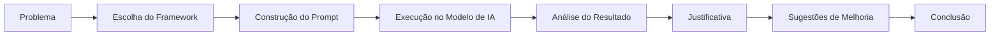
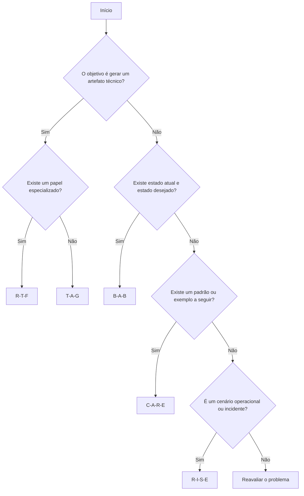
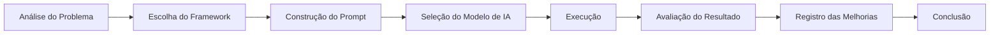

<p align="center">
  
</p>

# 🚀 Prompt Engineering Frameworks

> Aplicação prática de frameworks de Prompt Engineering utilizando diferentes Modelos de Linguagem (LLMs) em cenários reais de DevOps, SRE, Cloud Computing e Engenharia de Software.

---

## 📖 Sobre o Projeto

Este repositório foi desenvolvido como atividade da disciplina **Fundamentos de Inteligência Artificial – Prompt Engineering**, da Pós-Graduação.

O objetivo foi aplicar diferentes frameworks de construção de prompts para resolver desafios técnicos relacionados à infraestrutura, automação, Kubernetes, Terraform, Docker, AWS e Site Reliability Engineering (SRE).

Cada atividade foi documentada seguindo uma estrutura padronizada, permitindo analisar como diferentes estratégias de Prompt Engineering influenciam a qualidade dos resultados produzidos pelos Modelos de Linguagem.

---

---

# 🧭 Como Navegar pelo Projeto

Este repositório foi estruturado para proporcionar uma experiência de leitura organizada e progressiva, permitindo compreender desde os conceitos fundamentais de Prompt Engineering até a aplicação prática dos frameworks em diferentes cenários.

Para facilitar essa navegação, foi criado um guia específico contendo:

- Visão geral da estrutura do repositório;
- Finalidade de cada documento;
- Ordem recomendada de leitura;
- Organização interna das questões;
- Diagramas de navegação em Mermaid;
- Fluxos sugeridos para diferentes perfis de leitores.

📄 **Guia de Navegação:** [NAVIGATION.md](NAVIGATION.md)

📑 **Índice Geral do Projeto:** [SUMMARY.md](SUMMARY.md)

### 🚀 Primeiros Passos

1. **README.md** — Visão geral do projeto.
2. **NAVIGATION.md** — Estrutura e roteiro de navegação.
3. **SUMMARY.md** — Índice completo do projeto.
4. **frameworks.md** — Conceitos dos frameworks.
5. **framework-comparison.md** — Comparação entre os frameworks.
6. **decision-tree.md** — Fluxograma de decisão.
7. **Questões 01 a 08** — Desenvolvimento das atividades.
8. **lessons-learned.md** — Lições aprendidas.
9. **references.md** — Referências.

---

## 🎯 Objetivos

- Estudar os principais frameworks de Prompt Engineering.
- Aplicar cada framework em um cenário técnico diferente.
- Comparar a qualidade dos resultados produzidos por diferentes modelos de IA.
- Produzir documentação técnica organizada utilizando Markdown.
- Demonstrar aplicações práticas da IA Generativa em ambientes de infraestrutura e operações.

---

# 📚 Frameworks Utilizados

Durante o desenvolvimento do projeto foram utilizados os seguintes frameworks:

| Framework | Finalidade |
|------------|------------|
| **R-T-F** | Geração de artefatos técnicos estruturados |
| **T-A-G** | Análises técnicas e relatórios |
| **B-A-B** | Modernização e transformação de soluções existentes |
| **C-A-R-E** | Construção baseada em contexto e padrões |
| **R-I-S-E** | Runbooks, troubleshooting e incidentes |

---

# 🗂 Estrutura do Repositório

```text
prompt-engineering-frameworks/
│
├── README.md
├── SUMMARY.md
├── LICENSE
├── CHANGELOG.md
├── CONTRIBUTING.md
├── CODE_OF_CONDUCT.md
├── frameworks.md
├── framework-comparison.md
├── decision-tree.md
├── lessons-learned.md
├── references.md
├── build.sh
├── .gitignore
│
├── assets/
│   ├── diagrams/
│   └── images/
│
├── questao-01/
├── questao-02/
├── questao-03/
├── questao-04/
├── questao-05/
├── questao-06/
├── questao-07/
└── questao-08/
```

---

# 📂 Estrutura de Cada Questão

Todas as questões seguem exatamente o mesmo padrão de documentação.

```text
questao-XX/
│
├── README.md
├── SUMMARY.md
├── 01-contexto.md
├── 02-prompt.md
├── 03-modelo.md
├── 04-output.md
├── 05-justificativa.md
├── 06-melhorias.md
└── 07-conclusao.md
```

Essa padronização facilita a leitura, manutenção e comparação entre os diferentes estudos realizados.

---

# 🔄 Metodologia Utilizada



O fluxo acima representa a metodologia aplicada em todas as atividades desenvolvidas durante o projeto.

---

# 📋 Questões Desenvolvidas

| Questão | Tema | Framework |
|----------|------|-----------|
| Questão 01 | Dockerfile Seguro | R-T-F |
| Questão 02 | Estratégia de Backup | T-A-G |
| Questão 03 | Refatoração de Manifesto Kubernetes | B-A-B |
| Questão 04 | Pipeline CI/CD | R-T-F |
| Questão 05 | Manifesto Kubernetes Seguro | B-A-B |
| Questão 06 | Módulo Terraform Corporativo | C-A-R-E |
| Questão 07 | Runbook Operacional | R-I-S-E |
| Questão 08 | Postmortem Técnico | R-I-S-E |

---

# 🧠 Critérios para Escolha dos Frameworks

Cada framework foi selecionado considerando as características do problema proposto, o tipo de resposta esperada e o nível de estrutura necessário para orientar o Modelo de Linguagem.

A escolha adequada do framework contribuiu para a obtenção de respostas mais consistentes, organizadas e alinhadas aos objetivos de cada atividade.

---

# 📊 Comparação entre os Frameworks

| Framework | Estrutura | Melhor Aplicação | Exemplo Utilizado |
|------------|-----------|------------------|-------------------|
| **R-T-F** | Role • Task • Format | Geração de artefatos técnicos | Dockerfile, Pipeline CI/CD |
| **T-A-G** | Task • Action • Goal | Relatórios e análises | Estratégia de Backup |
| **B-A-B** | Before • After • Bridge | Modernização e refatoração | Manifestos Kubernetes |
| **C-A-R-E** | Context • Action • Result • Example | Soluções baseadas em padrões | Módulo Terraform |
| **R-I-S-E** | Role • Input • Steps • Expectation | Operações, Runbooks e Incidentes | Runbook e Postmortem |

---

# 🤖 Modelos de IA Utilizados

Durante o desenvolvimento das atividades foram utilizados diferentes Modelos de Linguagem, considerando suas características e pontos fortes para cada tipo de tarefa.

| Modelo | Principal Utilização |
|----------|----------------------|
| GPT-4o | Correlação de informações, análises técnicas e documentação |
| Claude Sonnet 4 | Runbooks, documentação operacional e procedimentos estruturados |
| Gemini 2.5 Pro | Infraestrutura como Código (Terraform) e geração de código estruturado |

A utilização de múltiplos modelos permitiu comparar diferentes abordagens para um mesmo problema, evidenciando que a escolha do modelo também influencia a qualidade da resposta obtida.

---

# 🔀 Fluxograma de Decisão

O diagrama abaixo resume uma estratégia simplificada para auxiliar na escolha do framework mais adequado conforme o tipo de problema.



---

# 📖 Documentação Complementar

Além das respostas das atividades, este repositório possui documentos complementares para aprofundar o estudo dos frameworks.

| Documento | Descrição |
|------------|-----------|
| `frameworks.md` | Descrição detalhada dos frameworks utilizados |
| `framework-comparison.md` | Comparação entre os frameworks |
| `decision-tree.md` | Fluxograma detalhado para seleção de frameworks |
| `lessons-learned.md` | Lições aprendidas durante o desenvolvimento |
| `references.md` | Referências bibliográficas e materiais consultados |

---

# 🎯 Metodologia Aplicada

Todas as atividades seguiram o mesmo processo metodológico.



Esse processo garantiu consistência na elaboração dos prompts, permitindo comparar os resultados obtidos entre diferentes frameworks e modelos de IA.

---

# 📦 Resumo das Questões Desenvolvidas

Cada questão foi desenvolvida utilizando um framework de Prompt Engineering considerado mais adequado ao problema proposto.

| Questão | Descrição | Framework | Modelo |
|----------|-----------|-----------|---------|
| Questão 01 | Construção de um Dockerfile seguro para aplicações Python | R-T-F | GPT-4o |
| Questão 02 | Definição de uma estratégia corporativa de backup para ambientes AWS | T-A-G | GPT-4o |
| Questão 03 | Refatoração de um manifesto Kubernetes para atender boas práticas | B-A-B | Claude Sonnet 4 |
| Questão 04 | Construção de um pipeline CI/CD para aplicações conteinerizadas | R-T-F | GPT-4o |
| Questão 05 | Modernização de um Deployment Kubernetes seguindo boas práticas | B-A-B | Claude Sonnet 4 |
| Questão 06 | Desenvolvimento de um módulo Terraform reutilizável para Amazon S3 | C-A-R-E | Gemini 2.5 Pro |
| Questão 07 | Elaboração de um Runbook operacional para incidentes em Kubernetes | R-I-S-E | Claude Sonnet 4 |
| Questão 08 | Produção de um Postmortem técnico para incidente em produção | R-I-S-E | GPT-4o |

---

# 🛠 Tecnologias e Conceitos Envolvidos

Ao longo das atividades foram utilizados conceitos relacionados às seguintes tecnologias e áreas de conhecimento:

- Inteligência Artificial Generativa
- Prompt Engineering
- Large Language Models (LLMs)
- Docker
- Kubernetes
- Terraform
- Amazon Web Services (AWS)
- Amazon S3
- Amazon EKS
- PostgreSQL
- Git e GitHub
- DevOps
- Site Reliability Engineering (SRE)
- Observabilidade
- Infraestrutura como Código (IaC)
- Segurança em Ambientes Cloud
- Documentação Técnica em Markdown

---

# 🎓 Competências Desenvolvidas

Durante a realização deste projeto foram exercitadas competências relacionadas a:

- Estruturação de prompts utilizando diferentes frameworks.
- Escolha do framework mais adequado para cada cenário.
- Comparação entre diferentes Modelos de Linguagem.
- Documentação técnica organizada em Markdown.
- Análise crítica dos resultados produzidos por IA Generativa.
- Aplicação prática dos conceitos em cenários de infraestrutura e operações.

---

# 💡 Sugestões de Evolução

Embora as soluções apresentadas atendam aos requisitos das atividades propostas, diversos aprimoramentos poderiam ser incorporados em um ambiente corporativo, tais como:

- Integração com pipelines de Integração Contínua e Entrega Contínua (CI/CD).
- Automatização de testes para validação dos artefatos produzidos.
- Aplicação de políticas de segurança e compliance.
- Expansão dos exemplos utilizando novos provedores de IA.
- Inclusão de novos frameworks de Prompt Engineering.
- Evolução da documentação com exemplos adicionais e estudos comparativos.

Essas melhorias não foram aplicadas diretamente às soluções desenvolvidas, sendo apresentadas apenas como possibilidades de evolução futura.

---

# 📚 Referências

As referências utilizadas durante o desenvolvimento deste projeto encontram-se no arquivo:

- `references.md`

---

# 🤝 Contribuição

As orientações para contribuição e organização do projeto estão disponíveis em:

- `CONTRIBUTING.md`

---

# 📜 Licença

Este projeto está licenciado sob a licença MIT.

Consulte o arquivo:

- `LICENSE`

---

# ✅ Conclusão

A realização deste projeto permitiu aplicar, de forma prática, diferentes frameworks de Prompt Engineering em cenários técnicos inspirados na rotina de profissionais de DevOps, SRE, Cloud Computing e Engenharia de Software.

Os resultados demonstram que a escolha adequada do framework influencia diretamente a qualidade das respostas produzidas pelos Modelos de Linguagem, contribuindo para maior clareza, consistência e alinhamento com os objetivos propostos.

Além da aplicação dos frameworks, o projeto também evidencia a importância da documentação técnica, da organização do conhecimento e da avaliação crítica das respostas geradas por Inteligência Artificial, aspectos fundamentais para o uso responsável e eficiente dessas tecnologias em ambientes profissionais.

---

**Desenvolvido como atividade da disciplina de Fundamentos de Inteligência Artificial – Prompt Engineering.**

## 🔗 Navegação

- 📑 [SUMÁRIO](SUMMARY.md)
- 🧭 [Guia de Navegação do Projeto](NAVIGATION.md)

---
