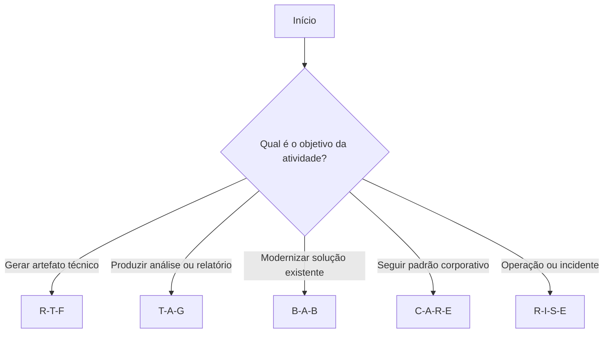
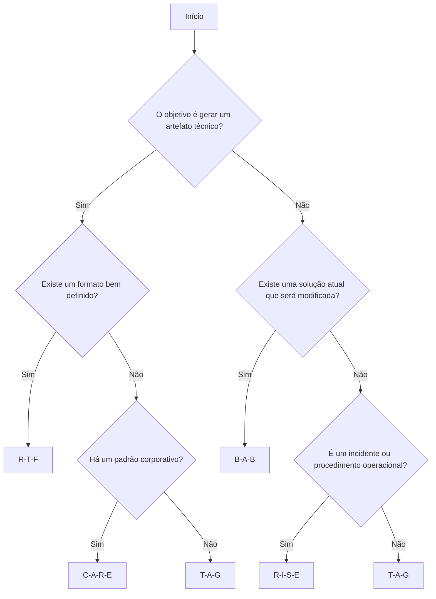
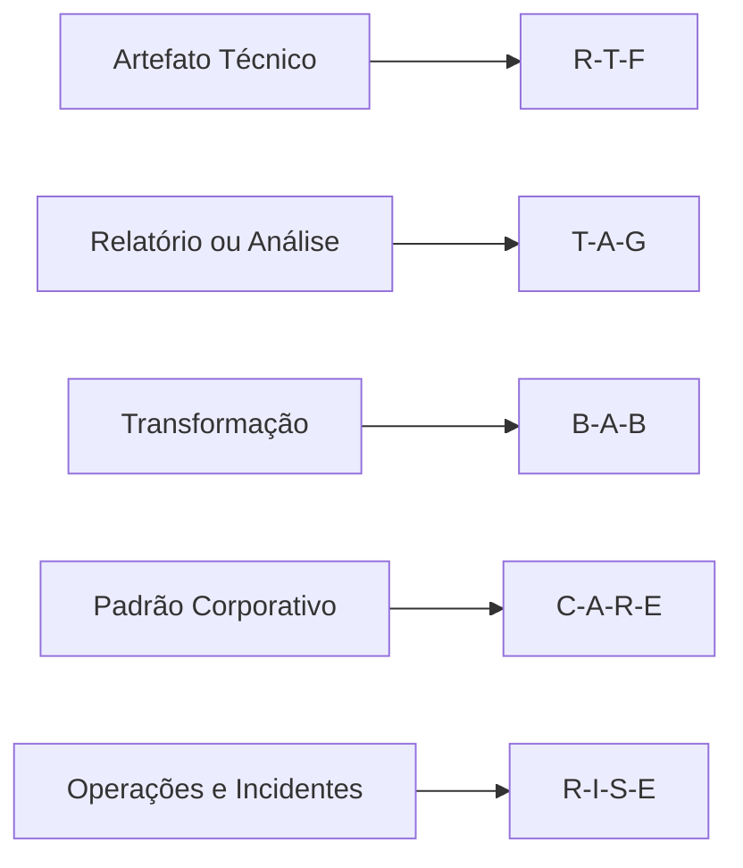

# 🌳 Árvore de Decisão para Seleção de Frameworks

## 📖 Introdução

A escolha do framework adequado é um dos fatores que mais influenciam a qualidade das respostas produzidas por um Modelo de Linguagem (LLM).

Cada framework possui características específicas e foi projetado para resolver determinados tipos de problemas.

Este documento apresenta uma árvore de decisão que auxilia na seleção do framework mais adequado conforme o contexto, o objetivo da atividade e o tipo de resultado esperado.

---

# 🎯 Objetivo

Fornecer um guia prático para apoiar a escolha do framework mais apropriado durante a elaboração de prompts, reduzindo ambiguidades e aumentando a consistência das respostas.

---

# 🧭 Fluxo Principal

---

# 📋 Visão Geral

| Tipo de Problema | Framework Recomendado |
|------------------|-----------------------|
| Dockerfiles | R-T-F |
| Scripts Bash | R-T-F |
| YAML Kubernetes | R-T-F |
| Pipelines CI/CD | R-T-F |
| Relatórios | T-A-G |
| Auditorias | T-A-G |
| Estratégias | T-A-G |
| Refatoração | B-A-B |
| Modernização | B-A-B |
| Terraform | C-A-R-E |
| Compliance | C-A-R-E |
| Runbooks | R-I-S-E |
| Troubleshooting | R-I-S-E |
| Incidentes | R-I-S-E |
| Postmortem | R-I-S-E |

---

# 🔍 Primeira Pergunta

Antes de iniciar a construção do prompt, recomenda-se responder à seguinte pergunta:

> **Qual é o principal resultado esperado desta interação com o modelo?**

A resposta para essa pergunta normalmente direciona a escolha do framework mais adequado.

---

# 📌 Exemplo

### Situação

Criar um Dockerfile seguro para uma aplicação Python.

**Resultado esperado:** geração de um artefato técnico.

**Framework recomendado:** **R-T-F**

---

### Situação

Criar um procedimento operacional para atendimento de incidentes.

**Resultado esperado:** documentação operacional.

**Framework recomendado:** **R-I-S-E**

---

# 🌲 Árvore de Decisão Detalhada

A sequência de perguntas abaixo auxilia na escolha do framework mais adequado para cada situação.

---

# 🧪 Exemplos Utilizando as Questões do Projeto

| Situação | Framework |
|----------|-----------|
| Criar um Dockerfile seguro | R-T-F |
| Definir uma estratégia de backup | T-A-G |
| Refatorar um manifesto Kubernetes | B-A-B |
| Criar um pipeline CI/CD | R-T-F |
| Modernizar um Deployment Kubernetes | B-A-B |
| Desenvolver um módulo Terraform corporativo | C-A-R-E |
| Elaborar um Runbook Operacional | R-I-S-E |
| Produzir um Postmortem Técnico | R-I-S-E |

---

# ⚠️ Erros Comuns na Escolha do Framework

A seleção inadequada do framework pode resultar em respostas menos consistentes ou exigir maior esforço de refinamento do prompt.

Alguns erros comuns incluem:

- Utilizar **R-T-F** para atividades que exigem investigação aprofundada.
- Empregar **T-A-G** quando o objetivo principal é gerar código ou arquivos de configuração.
- Aplicar **B-A-B** em cenários que não envolvem transformação entre estados.
- Utilizar **C-A-R-E** sem fornecer contexto suficiente ou exemplos representativos.
- Adotar **R-I-S-E** para tarefas simples que poderiam ser resolvidas com estruturas mais objetivas.

---

# ✅ Recomendações

Antes de selecionar um framework, considere os seguintes aspectos:

- O resultado esperado é um artefato técnico ou uma análise?
- Existe um padrão corporativo que deve ser seguido?
- A atividade envolve transformação de uma solução existente?
- O problema exige investigação detalhada ou resposta a incidentes?
- Há necessidade de orientar o modelo passo a passo?

Responder a essas perguntas facilita a escolha do framework mais adequado.

---

# 🧭 Fluxo Resumido

---

# 🎯 Conclusão

A escolha do framework deve considerar o contexto da atividade, o tipo de resposta desejada e o nível de detalhamento necessário.

Ao longo deste projeto, observou-se que diferentes problemas demandaram abordagens distintas, reforçando que a aplicação consciente dos frameworks é um fator importante para obtenção de respostas mais consistentes, reutilizáveis e alinhadas aos objetivos propostos.

Esta árvore de decisão pode ser utilizada como um guia rápido durante a elaboração de novos prompts, auxiliando na seleção da estrutura mais adequada para cada cenário.

---

# 💡 Sugestões de Melhoria

Embora a árvore de decisão atenda aos objetivos deste projeto, algumas evoluções poderiam ser implementadas em versões futuras:

- Criar uma versão interativa da árvore utilizando uma página HTML com navegação dinâmica.
- Adicionar exemplos práticos para cada ramo da decisão.
- Incluir cenários híbridos em que dois frameworks possam ser combinados.
- Incorporar novos frameworks de Prompt Engineering à medida que surgirem abordagens consolidadas.
- Desenvolver um assistente automatizado para recomendar o framework mais adequado a partir da descrição do problema.

Essas melhorias ampliariam o valor do documento como material de consulta para estudantes e profissionais interessados em Engenharia de Prompts.
