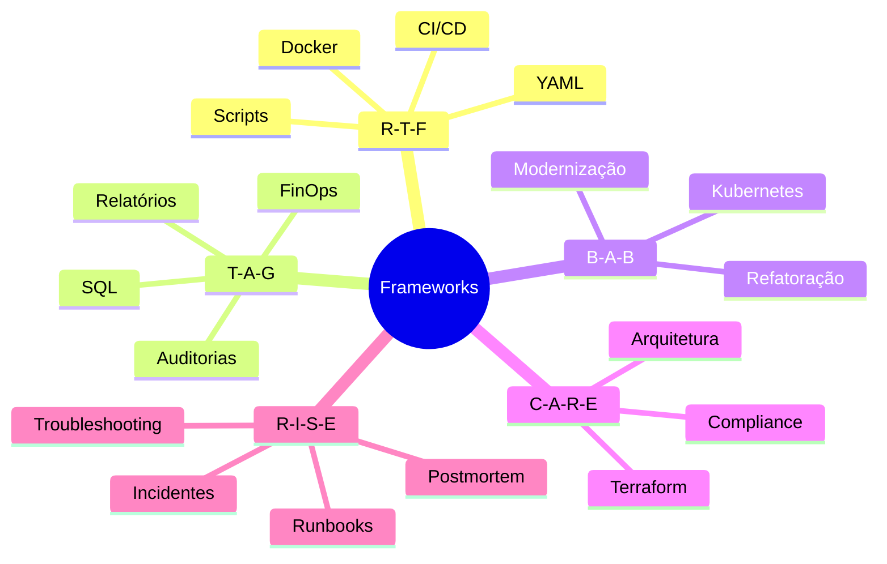
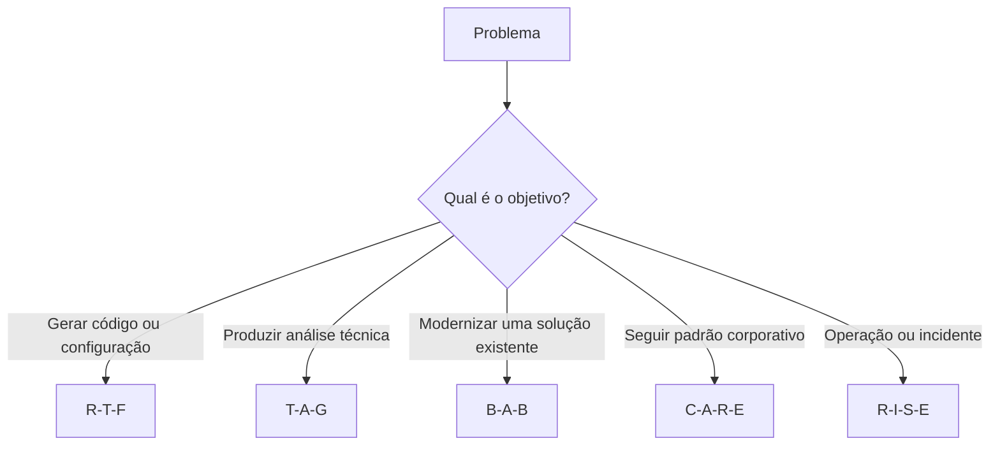

# 📊 Comparação entre os Frameworks de Prompt Engineering

## 📖 Introdução

Os frameworks de Prompt Engineering possuem características distintas e são mais adequados para determinados tipos de problemas.

A escolha correta do framework influencia diretamente a qualidade, organização e consistência das respostas produzidas pelos Modelos de Linguagem (LLMs).

Este documento apresenta uma comparação entre os frameworks utilizados neste projeto, destacando seus pontos fortes, limitações e cenários de aplicação.

---

# 🎯 Objetivo

Este comparativo tem como finalidade auxiliar na seleção do framework mais adequado para cada tipo de atividade, servindo como material de consulta rápida para futuras implementações.

---

# 📋 Visão Geral

| Framework | Estrutura | Complexidade | Principal Aplicação |
|------------|-----------|--------------|---------------------|
| **R-T-F** | Role • Task • Format | Baixa | Geração de artefatos técnicos |
| **T-A-G** | Task • Action • Goal | Média | Relatórios e análises |
| **B-A-B** | Before • After • Bridge | Média | Modernização e transformação |
| **C-A-R-E** | Context • Action • Result • Example | Média/Alta | Soluções baseadas em padrões |
| **R-I-S-E** | Role • Input • Steps • Expectation | Alta | Operações e incidentes |

---

# 📈 Comparação por Critério

| Critério | R-T-F | T-A-G | B-A-B | C-A-R-E | R-I-S-E |
|----------|:-----:|:-----:|:-----:|:--------:|:--------:|
| Facilidade de utilização | ⭐⭐⭐⭐⭐ | ⭐⭐⭐⭐☆ | ⭐⭐⭐⭐☆ | ⭐⭐⭐☆☆ | ⭐⭐⭐☆☆ |
| Organização da resposta | ⭐⭐⭐⭐⭐ | ⭐⭐⭐⭐⭐ | ⭐⭐⭐⭐☆ | ⭐⭐⭐⭐⭐ | ⭐⭐⭐⭐⭐ |
| Contextualização | ⭐⭐⭐☆☆ | ⭐⭐⭐⭐☆ | ⭐⭐⭐☆☆ | ⭐⭐⭐⭐⭐ | ⭐⭐⭐⭐⭐ |
| Reutilização | ⭐⭐⭐⭐⭐ | ⭐⭐⭐⭐☆ | ⭐⭐⭐⭐☆ | ⭐⭐⭐⭐⭐ | ⭐⭐⭐⭐☆ |
| Documentação técnica | ⭐⭐⭐⭐⭐ | ⭐⭐⭐⭐☆ | ⭐⭐⭐⭐☆ | ⭐⭐⭐⭐⭐ | ⭐⭐⭐⭐⭐ |
| Procedimentos operacionais | ⭐⭐☆☆☆ | ⭐⭐⭐☆☆ | ⭐⭐☆☆☆ | ⭐⭐⭐☆☆ | ⭐⭐⭐⭐⭐ |
| Investigação de problemas | ⭐⭐☆☆☆ | ⭐⭐⭐⭐☆ | ⭐⭐⭐☆☆ | ⭐⭐⭐☆☆ | ⭐⭐⭐⭐⭐ |

---

# 🧭 Comparação Visual

---

# 📌 Resumo

Cada framework apresenta vantagens específicas e deve ser escolhido considerando o contexto do problema, o tipo de resposta desejada e o nível de detalhamento necessário.

Não existe um framework universalmente melhor; a efetividade depende da adequação entre o framework e a atividade proposta.

---

# 🧪 Aplicação dos Frameworks neste Projeto

Ao longo das oito atividades propostas, cada framework foi selecionado considerando o tipo de problema, o formato da resposta esperada e o nível de estrutura necessário.

| Questão | Problema | Framework | Motivo da Escolha |
|----------|----------|-----------|-------------------|
| 01 | Dockerfile Seguro | R-T-F | Geração de um artefato técnico estruturado. |
| 02 | Estratégia de Backup | T-A-G | Necessidade de análise e definição de uma estratégia. |
| 03 | Refatoração de Manifesto Kubernetes | B-A-B | Transformação de um manifesto existente para uma versão modernizada. |
| 04 | Pipeline CI/CD | R-T-F | Construção de um pipeline técnico com formato conhecido. |
| 05 | Manifesto Kubernetes Seguro | B-A-B | Evolução de um Deployment para atender boas práticas. |
| 06 | Módulo Terraform Corporativo | C-A-R-E | Existência de padrões corporativos obrigatórios e exemplo de referência. |
| 07 | Runbook Operacional | R-I-S-E | Elaboração de um procedimento operacional estruturado. |
| 08 | Postmortem Técnico | R-I-S-E | Investigação de incidente com múltiplas evidências e tomada de decisão. |

---

# 📌 Quando Utilizar Cada Framework

| Framework | Utilizar Quando | Evitar Quando |
|------------|-----------------|---------------|
| **R-T-F** | O objetivo for gerar código, scripts ou documentos técnicos com formato conhecido. | O problema exigir investigação detalhada ou múltiplas hipóteses. |
| **T-A-G** | Houver necessidade de análise estruturada, relatórios ou avaliações técnicas. | O foco principal for gerar artefatos técnicos completos. |
| **B-A-B** | Existir uma solução atual que precisa ser modernizada ou evoluída. | O problema não envolver transformação entre estados. |
| **C-A-R-E** | Houver padrões corporativos, exemplos ou requisitos obrigatórios a seguir. | Não existir contexto suficiente ou padrão de referência. |
| **R-I-S-E** | O cenário envolver operações, incidentes, troubleshooting ou procedimentos. | A atividade for simples e puder ser resolvida com um prompt mais objetivo. |

---

# ⚖️ Vantagens e Limitações

| Framework | Principais Vantagens | Principais Limitações |
|------------|----------------------|-----------------------|
| **R-T-F** | Simples, objetivo e excelente para geração de artefatos técnicos. | Pouco indicado para análises complexas. |
| **T-A-G** | Estrutura bem análises e relatórios. | Menos eficiente para geração de código. |
| **B-A-B** | Facilita a visualização da transformação entre estados. | Não é adequado para investigação de incidentes. |
| **C-A-R-E** | Produz respostas aderentes a padrões e exemplos. | Depende de contexto e referências bem definidos. |
| **R-I-S-E** | Excelente para documentação operacional e troubleshooting. | Prompts mais extensos e detalhados. |

---

# 🧭 Fluxo Simplificado para Escolha do Framework

---

# 📈 Comparativo Final

| Critério | R-T-F | T-A-G | B-A-B | C-A-R-E | R-I-S-E |
|----------|:-----:|:-----:|:-----:|:--------:|:--------:|
| Facilidade de Aprendizado | ⭐⭐⭐⭐⭐ | ⭐⭐⭐⭐☆ | ⭐⭐⭐⭐☆ | ⭐⭐⭐☆☆ | ⭐⭐⭐☆☆ |
| Estruturação da Resposta | ⭐⭐⭐⭐⭐ | ⭐⭐⭐⭐⭐ | ⭐⭐⭐⭐☆ | ⭐⭐⭐⭐⭐ | ⭐⭐⭐⭐⭐ |
| Flexibilidade | ⭐⭐⭐☆☆ | ⭐⭐⭐⭐☆ | ⭐⭐⭐⭐☆ | ⭐⭐⭐⭐⭐ | ⭐⭐⭐⭐⭐ |
| Aplicação em DevOps | ⭐⭐⭐⭐⭐ | ⭐⭐⭐⭐☆ | ⭐⭐⭐⭐⭐ | ⭐⭐⭐⭐⭐ | ⭐⭐⭐⭐⭐ |
| Aplicação em SRE | ⭐⭐☆☆☆ | ⭐⭐⭐⭐☆ | ⭐⭐⭐☆☆ | ⭐⭐⭐☆☆ | ⭐⭐⭐⭐⭐ |
| Aplicação em IaC | ⭐⭐⭐⭐☆ | ⭐⭐⭐☆☆ | ⭐⭐⭐☆☆ | ⭐⭐⭐⭐⭐ | ⭐⭐⭐☆☆ |

---

# 💭 Considerações Finais

A comparação realizada demonstra que não existe um framework universalmente superior. Cada um apresenta características específicas que o tornam mais adequado para determinados cenários.

Durante a execução deste projeto foi possível observar que:

- O **R-T-F** apresentou melhor desempenho na geração de artefatos técnicos.
- O **T-A-G** foi mais eficiente para análises e estratégias.
- O **B-A-B** mostrou-se adequado para atividades de modernização e evolução de soluções.
- O **C-A-R-E** destacou-se em cenários com padrões corporativos e requisitos de conformidade.
- O **R-I-S-E** produziu os melhores resultados para documentação operacional, investigação de incidentes e elaboração de procedimentos.

A correta escolha do framework contribuiu para respostas mais organizadas, coerentes e alinhadas aos objetivos de cada atividade, reforçando a importância da estruturação dos prompts no contexto da Inteligência Artificial Generativa.

---
