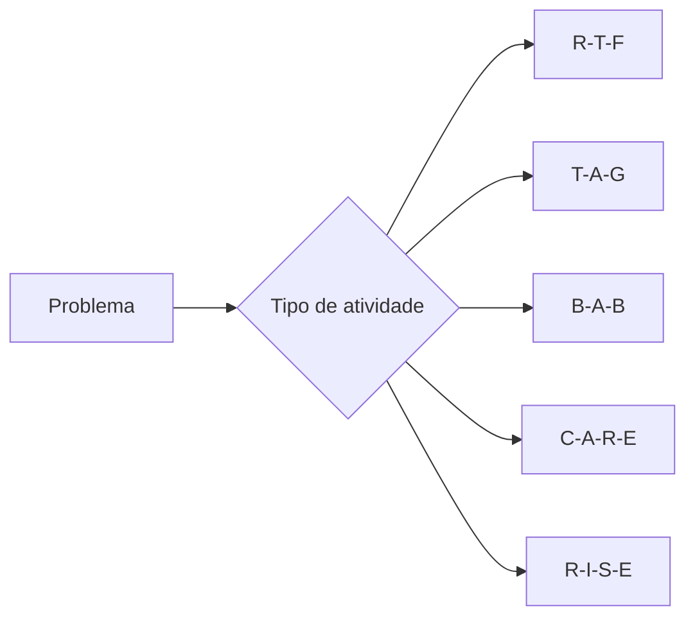
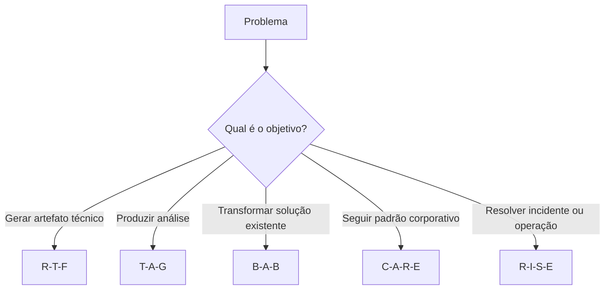

# 📚 Frameworks de Prompt Engineering

## 📖 Introdução

Durante o desenvolvimento deste projeto foram utilizados cinco frameworks de Prompt Engineering, cada um selecionado de acordo com as características do problema proposto.

Embora todos tenham o objetivo de orientar um Modelo de Linguagem (LLM) na geração de respostas mais consistentes, cada framework possui uma estrutura própria e é mais adequado para determinados tipos de tarefas.

Este documento apresenta uma visão geral de cada framework, destacando sua finalidade, estrutura, vantagens, limitações e exemplos de aplicação.

---

# 🎯 O que é um Framework de Prompt Engineering?

Um framework de Prompt Engineering é uma estrutura organizada utilizada para construir prompts de maneira clara, consistente e orientada a resultados.

Assim como metodologias auxiliam no desenvolvimento de software, os frameworks auxiliam na elaboração de instruções para Modelos de Linguagem, reduzindo ambiguidades e aumentando a qualidade das respostas produzidas.

Entre os principais benefícios da utilização de frameworks estão:

- Maior organização dos prompts.
- Redução de ambiguidades.
- Melhor aproveitamento do contexto fornecido ao modelo.
- Respostas mais consistentes.
- Facilidade de reutilização dos prompts.
- Padronização na interação com diferentes modelos de IA.

---

# 🧩 Frameworks Utilizados

Durante este projeto foram empregados os seguintes frameworks:

| Framework | Objetivo Principal |
|------------|-------------------|
| R-T-F | Geração de artefatos técnicos estruturados |
| T-A-G | Relatórios e análises |
| B-A-B | Transformação e modernização |
| C-A-R-E | Construção baseada em contexto e exemplos |
| R-I-S-E | Operações, troubleshooting e incidentes |

---

# 🔄 Visão Geral

O diagrama apresenta uma visão simplificada da seleção dos frameworks utilizados ao longo deste projeto.

---

# 🟦 Framework R-T-F

## Estrutura

- **Role** — Define o papel que o modelo deve assumir.
- **Task** — Define claramente a atividade a ser executada.
- **Format** — Especifica o formato esperado para a resposta.

---

## Quando utilizar

O framework R-T-F é indicado quando o objetivo é produzir um artefato técnico bem definido, com estrutura conhecida e formato previsível.

Exemplos:

- Dockerfiles
- Scripts Bash
- Manifestos YAML
- Pipelines CI/CD
- Arquivos de configuração
- Documentação técnica

---

## Vantagens

- Simplicidade de utilização.
- Estrutura objetiva.
- Respostas altamente organizadas.
- Fácil reutilização.
- Baixa ambiguidade.

---

## Limitações

- Pouco adequado para problemas analíticos complexos.
- Não orienta investigações detalhadas.
- Menor flexibilidade em cenários exploratórios.

---

## Aplicação neste Projeto

O framework R-T-F foi utilizado nas seguintes atividades:

- Questão 01 – Dockerfile Seguro.
- Questão 04 – Pipeline CI/CD.

Em ambos os casos, o objetivo era produzir artefatos técnicos com estrutura previamente conhecida.

---

# 🟩 Framework T-A-G

## Estrutura

O framework T-A-G é composto por três elementos:

- **Task** — Define claramente a tarefa a ser realizada.
- **Action** — Especifica as ações que o modelo deve executar para resolver a tarefa.
- **Goal** — Define o objetivo final esperado para a resposta.

---

## Quando utilizar

O T-A-G é recomendado para atividades que exigem análise, interpretação de informações ou produção de relatórios técnicos estruturados.

Exemplos de utilização:

- Relatórios técnicos
- Auditorias
- Estratégias de Backup
- Análises FinOps
- Consultas SQL
- Relatórios de conformidade
- Avaliações de arquitetura

---

## Vantagens

- Excelente organização lógica.
- Orienta o modelo durante todo o processo de análise.
- Reduz respostas superficiais.
- Produz relatórios bem estruturados.
- Fácil adaptação para diferentes áreas técnicas.

---

## Limitações

- Pouco indicado para geração de código.
- Não possui mecanismo explícito para fornecer contexto detalhado.
- Pode exigir prompts mais extensos em cenários complexos.

---

## Aplicação neste Projeto

Neste projeto, o framework T-A-G foi aplicado na:

- **Questão 02 – Estratégia Corporativa de Backup**

A estrutura permitiu decompor o problema em etapas claras de análise, definição da estratégia e apresentação do resultado esperado.

---

# 🟨 Framework B-A-B

## Estrutura

O framework B-A-B é composto por três etapas:

- **Before** — Situação atual ou estado inicial.
- **After** — Situação desejada após a solução.
- **Bridge** — Caminho necessário para transformar o estado atual no estado desejado.

---

## Quando utilizar

O B-A-B é indicado para cenários que envolvem evolução, modernização ou transformação de soluções existentes.

Exemplos:

- Refatoração de código
- Atualização de manifestos Kubernetes
- Modernização de infraestrutura
- Migração entre versões
- Evolução arquitetural
- Otimização de configurações

---

## Vantagens

- Estrutura intuitiva.
- Facilita a compreensão do problema.
- Evidencia claramente a transformação proposta.
- Excelente para documentação de melhorias.
- Favorece respostas objetivas.

---

## Limitações

- Não é indicado para problemas investigativos.
- Pouco adequado para incidentes operacionais.
- Pode ser insuficiente quando há múltiplas causas envolvidas.

---

## Aplicação neste Projeto

O framework B-A-B foi utilizado nas seguintes atividades:

- **Questão 03 – Refatoração de Manifesto Kubernetes**
- **Questão 05 – Manifesto Kubernetes Seguro**

Em ambos os casos, o objetivo era demonstrar a evolução de uma configuração existente para uma solução mais aderente às boas práticas de segurança, disponibilidade e organização.

---

# 📊 Comparativo Parcial

| Framework | Principal Objetivo | Melhor Aplicação |
|------------|-------------------|------------------|
| **R-T-F** | Produção de artefatos técnicos | Dockerfiles, Scripts, YAML |
| **T-A-G** | Análise estruturada | Relatórios, Auditorias, Estratégias |
| **B-A-B** | Transformação de soluções | Refatoração, Modernização, Migração |

---

# 🟧 Framework C-A-R-E

## Estrutura

O framework C-A-R-E é composto por quatro elementos:

- **Context** — Apresenta o contexto e as informações necessárias para a compreensão do problema.
- **Action** — Define claramente a atividade que o modelo deve executar.
- **Result** — Especifica o resultado esperado.
- **Example** — Fornece um exemplo ou padrão de referência para orientar a resposta.

---

## Quando utilizar

O C-A-R-E é indicado quando existe um padrão técnico, arquitetura de referência ou modelo corporativo que deve ser seguido.

Exemplos:

- Módulos Terraform
- Arquiteturas corporativas
- Padrões de infraestrutura
- Templates reutilizáveis
- Políticas de compliance
- Padronização de recursos em Cloud

---

## Vantagens

- Excelente aderência a padrões corporativos.
- Reduz ambiguidades.
- Produz respostas consistentes.
- Facilita a reutilização dos artefatos.
- Muito eficiente quando há exemplos de referência.

---

## Limitações

- Depende da existência de um bom contexto.
- Pode gerar respostas incompletas quando o exemplo fornecido é insuficiente.
- Requer maior detalhamento do prompt.

---

## Aplicação neste Projeto

O framework C-A-R-E foi utilizado na:

- **Questão 06 – Módulo Terraform Corporativo**

A estrutura permitiu definir requisitos obrigatórios de segurança, padronização e reutilização, produzindo um módulo aderente às boas práticas da organização.

---

# 🟥 Framework R-I-S-E

## Estrutura

O framework R-I-S-E é composto por quatro elementos:

- **Role** — Define o papel especializado assumido pelo modelo.
- **Input** — Apresenta todas as informações disponíveis sobre o cenário.
- **Steps** — Define a sequência de atividades que devem ser executadas.
- **Expectation** — Especifica o resultado esperado.

---

## Quando utilizar

O R-I-S-E é recomendado para cenários operacionais, investigação de incidentes e documentação procedural.

Exemplos:

- Runbooks
- Troubleshooting
- Resposta a incidentes
- Postmortem
- Procedimentos operacionais
- Playbooks SRE

---

## Vantagens

- Excelente organização das informações.
- Orienta investigações complexas.
- Produz documentação operacional reutilizável.
- Facilita a tomada de decisão.
- Muito adequado para ambientes de produção.

---

## Limitações

- Prompts normalmente mais extensos.
- Requer informações detalhadas do ambiente.
- Pode ser excessivo para problemas simples.

---

## Aplicação neste Projeto

O framework R-I-S-E foi utilizado nas seguintes atividades:

- **Questão 07 – Runbook Operacional**
- **Questão 08 – Postmortem Técnico**

Sua estrutura permitiu organizar informações operacionais, critérios de decisão, procedimentos de mitigação e recomendações de melhoria.

---

# 📈 Comparação Geral

| Framework | Complexidade | Melhor Aplicação | Questões |
|------------|--------------|------------------|-----------|
| **R-T-F** | Baixa | Artefatos técnicos | 01 e 04 |
| **T-A-G** | Média | Relatórios e análises | 02 |
| **B-A-B** | Média | Modernização | 03 e 05 |
| **C-A-R-E** | Média/Alta | Padrões corporativos | 06 |
| **R-I-S-E** | Alta | Operações e incidentes | 07 e 08 |

---

# 💡 Boas Práticas

Independentemente do framework utilizado, algumas práticas contribuem para melhorar a qualidade dos prompts:

- Definir claramente o objetivo da atividade.
- Fornecer contexto suficiente para o modelo.
- Informar o formato esperado da resposta.
- Evitar ambiguidades e instruções conflitantes.
- Utilizar exemplos quando necessário.
- Revisar criticamente os resultados produzidos antes da utilização.

---

# 🧭 Relação entre os Frameworks

---

# ✅ Conclusão

Os cinco frameworks utilizados neste projeto possuem características distintas e complementares.

A escolha adequada do framework depende principalmente do contexto, do objetivo da atividade e do tipo de resposta esperada.

Ao longo das oito questões foi possível observar que:

- **R-T-F** apresentou melhor desempenho na geração de artefatos técnicos.
- **T-A-G** mostrou-se eficiente para análises estruturadas.
- **B-A-B** foi especialmente útil em cenários de modernização.
- **C-A-R-E** destacou-se na construção de soluções baseadas em padrões corporativos.
- **R-I-S-E** apresentou os melhores resultados para documentação operacional e análise de incidentes.

A utilização consciente desses frameworks contribui para respostas mais organizadas, consistentes e alinhadas aos objetivos do problema proposto.
