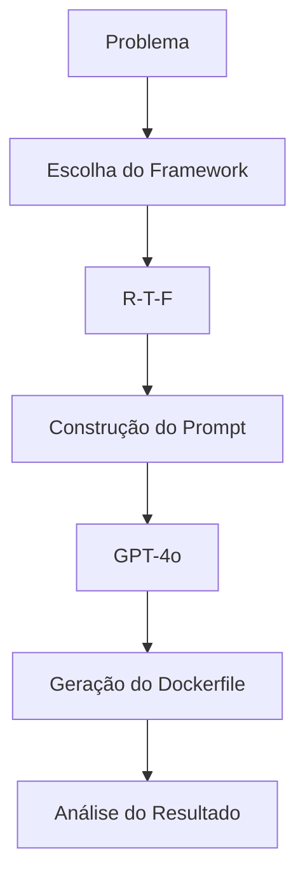

# Questão 01 – Criação de um Dockerfile para uma Aplicação Flask

## Objetivo

Esta questão teve como objetivo aplicar um framework de Prompt Engineering para orientar um Modelo de Linguagem (LLM) na geração de um **Dockerfile** destinado à execução de uma aplicação Python desenvolvida com o framework Flask.

Além da geração do código, buscou-se avaliar como a estrutura do prompt influencia a qualidade, organização e aderência da resposta às boas práticas de conteinerização.

---

# Contexto

Containers tornaram-se o padrão para empacotamento e distribuição de aplicações modernas.

Entretanto, a simples criação de um Dockerfile não garante:

- segurança;
- desempenho;
- tamanho reduzido da imagem;
- facilidade de manutenção;
- aderência às boas práticas recomendadas.

Neste cenário foi solicitado ao modelo de IA produzir um Dockerfile seguindo práticas recomendadas para ambientes de produção.

---

# Framework Utilizado

## R-T-F

```
Role

Task

Format
```

### Justificativa

O framework **R-T-F** foi escolhido por permitir definir claramente:

- o papel assumido pelo modelo;
- a tarefa a ser executada;
- o formato esperado da resposta.

Como o objetivo era gerar um artefato técnico (Dockerfile), esse framework mostrou-se adequado por reduzir ambiguidades e direcionar a geração do código.

---

# Modelo Utilizado

**GPT-4o**

### Motivos da escolha

O modelo GPT-4o apresentou excelente desempenho na geração de código técnico, especialmente para:

- Docker;
- Kubernetes;
- Bash;
- YAML;
- DevOps.

Além disso, sua capacidade de seguir instruções estruturadas contribuiu para a produção de um Dockerfile consistente.

---

# Arquivos desta Questão

| Arquivo | Descrição |
|----------|-----------|
| `prompt.md` | Prompt completo utilizado durante o experimento. |
| `modelo.md` | Justificativa para a escolha do modelo de IA. |
| `output.md` | Resposta produzida pelo modelo. |
| `justificativa.md` | Fundamentação da escolha do framework. |

---

# Fluxo da Solução



---

# Resultado Esperado

Espera-se obter um Dockerfile contendo boas práticas como:

- imagem base apropriada;
- utilização de camadas eficientes;
- redução do tamanho final da imagem;
- organização das instruções;
- definição do diretório de trabalho;
- instalação de dependências;
- configuração do comando de inicialização.

---

# Sugestões de Melhoria

Embora a resposta produzida pelo modelo atenda ao objetivo proposto, em um ambiente corporativo poderiam ser consideradas evoluções como:

- utilização de imagens mínimas (*slim* ou *distroless*);
- execução da aplicação com usuário não privilegiado;
- definição explícita de `HEALTHCHECK`;
- utilização de *multi-stage build*;
- redução da quantidade de camadas;
- fixação de versões das dependências;
- integração com ferramentas de análise de vulnerabilidades.

Essas observações representam possíveis evoluções para ambientes de produção e **não alteram o conteúdo originalmente produzido pelo modelo de IA**.

---

# Conclusão

A utilização do framework R-T-F mostrou-se adequada para a geração de um artefato técnico estruturado.

A definição explícita do papel do modelo, da tarefa e do formato esperado contribuiu para reduzir ambiguidades e orientar a produção de um Dockerfile organizado, demonstrando a importância da Engenharia de Prompt na obtenção de resultados consistentes.

---

## 🔗 Navegação

- ⬅️ Questão anterior
- 🏠 [README Principal](../README.md)
- ➡️ Próxima questão
