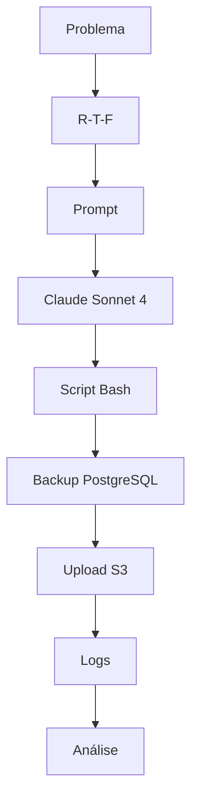

# Questão 02 – Script de Backup do Ledger

## Objetivo

Esta atividade teve como objetivo aplicar um framework de Prompt Engineering para orientar um Modelo de Linguagem (LLM) na geração de um script Bash destinado à automação do backup do banco de dados PostgreSQL da aplicação **Ledger**, contemplando boas práticas de SRE, automação, segurança e integração com a AWS.

O foco da atividade não foi apenas produzir um script funcional, mas avaliar como a estrutura do prompt influencia diretamente a qualidade do código gerado e sua aderência aos requisitos operacionais.

---

# Cenário

A empresa fictícia **Hill Valley Tech** mantém aplicações críticas hospedadas na AWS.

Uma dessas aplicações utiliza o banco PostgreSQL **ledger_prod**, cujo backup precisa ser executado diariamente de forma automatizada.

A solução deveria atender requisitos de segurança, rastreabilidade, tratamento de erros, armazenamento em S3 e preparação para execução via cron.

---

# Framework Utilizado

## R-T-F

```
Role
Task
Format
```

### Justificativa

O framework **R-T-F** foi escolhido porque permite definir claramente:

- o especialista que o modelo deverá representar;
- a atividade que deverá executar;
- o formato esperado da resposta.

Como o objetivo consistia em gerar um script operacional completo, essa estrutura mostrou-se adequada para reduzir ambiguidades e aumentar a qualidade do resultado.

---

# Modelo Utilizado

**Claude Sonnet 4**

### Motivo da escolha

O Claude Sonnet 4 foi selecionado devido à sua excelente capacidade na geração de:

- Shell Script
- Bash
- Automações
- Infraestrutura
- Tratamento de erros
- Código altamente legível

---

# Arquivos desta Questão

| Arquivo | Descrição |
|----------|-----------|
| README.md | Visão geral da atividade |
| 01-contexto.md | Contextualização do problema |
| 02-prompt.md | Prompt original utilizado |
| 03-modelo.md | Justificativa da escolha do modelo |
| 04-output.md | Script gerado pelo modelo |
| 05-justificativa.md | Justificativa do framework |
| 06-melhorias.md | Sugestões de evolução |
| 07-conclusao.md | Conclusões da atividade |

---

# Fluxo da Solução



---

# Resultado Esperado

Ao final da atividade espera-se obter um script capaz de:

- validar dependências;
- executar backup utilizando pg_dump;
- compactar o arquivo;
- enviar automaticamente para o Amazon S3;
- registrar logs detalhados;
- tratar erros adequadamente;
- executar via cron.

---

# Sugestões de Melhoria

As sugestões de evolução são apresentadas separadamente no arquivo **06-melhorias.md**, preservando integralmente o experimento realizado.

---

# Conclusão

Esta atividade demonstra a aplicação do framework R-T-F na geração de scripts operacionais robustos, evidenciando como uma boa Engenharia de Prompt influencia diretamente a qualidade do código produzido.

---

## 🔗 Navegação

- ⬅️ Questão anterior
- 🏠 [README Principal](../README.md)
- ➡️ Próxima questão
