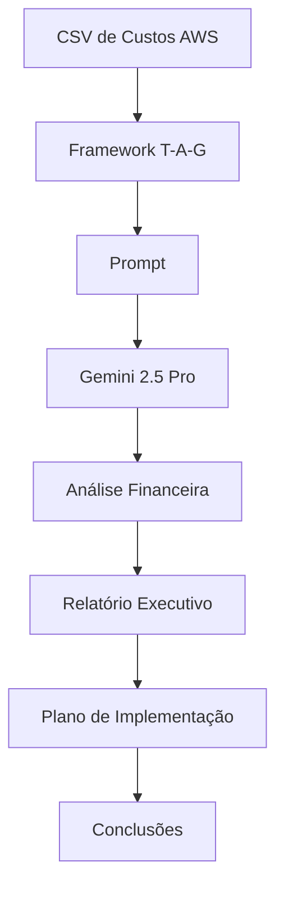

# Questão 03 – Relatório Executivo de Redução de Custos AWS

## Objetivo

Esta atividade teve como objetivo aplicar o framework **T-A-G (Task – Action – Goal)** para orientar um Modelo de Linguagem (LLM) na análise de custos de uma infraestrutura AWS e na elaboração de um relatório executivo contendo oportunidades de otimização financeira.

O desafio consistiu em interpretar uma planilha de custos, identificar oportunidades de economia, estimar ganhos financeiros e produzir recomendações estratégicas sem comprometer o SLA, a disponibilidade e a segurança operacional.

---

# Cenário

A empresa fictícia **Hill Valley Tech** estabeleceu uma meta corporativa de reduzir em pelo menos **15%** os custos mensais da infraestrutura em nuvem.

Foi disponibilizado um conjunto de dados contendo informações sobre diversos serviços da AWS, incluindo:

- Amazon EC2;
- Amazon EKS;
- Amazon RDS PostgreSQL;
- Amazon ElastiCache;
- Amazon S3;
- Amazon EBS;
- Amazon CloudWatch;
- Data Transfer;
- NAT Gateway;
- AWS Lambda.

A partir desses dados, o modelo deveria identificar oportunidades de otimização e apresentar um plano de implementação priorizado. :contentReference[oaicite:0]{index=0}

---

# Framework Utilizado

## T-A-G

```
Task

↓

Action

↓

Goal
```

### Justificativa

O framework **T-A-G** foi escolhido por estruturar o problema em três componentes:

- definição clara da tarefa;
- sequência lógica de ações;
- objetivo final orientado ao negócio.

Essa abordagem mostrou-se adequada para atividades analíticas que exigem raciocínio estruturado e tomada de decisão baseada em dados.

---

# Modelo Utilizado

**Gemini 2.5 Pro**

### Motivo da escolha

O modelo foi selecionado por sua elevada capacidade de:

- interpretar tabelas;
- analisar dados financeiros;
- produzir relatórios executivos;
- sintetizar informações complexas;
- priorizar recomendações estratégicas. :contentReference[oaicite:1]{index=1}

---

# Estrutura da Questão

| Arquivo | Descrição |
|----------|-----------|
| README.md | Visão geral da atividade |
| 01-contexto.md | Contextualização do problema |
| 02-prompt.md | Prompt utilizado |
| 03-modelo.md | Justificativa do modelo |
| 04-output.md | Relatório produzido pelo modelo |
| 05-justificativa.md | Justificativa do framework |
| 06-melhorias.md | Sugestões de evolução |
| 07-conclusao.md | Conclusão da atividade |

---

# Fluxo da Solução



---

# Resultado Esperado

Ao final da atividade espera-se obter:

- cálculo do custo mensal total;
- identificação das oportunidades de redução;
- estimativa de economia por iniciativa;
- priorização das ações;
- classificação de impacto e esforço;
- avaliação da viabilidade da meta de redução de 15%.

---

# Conclusão

Esta atividade demonstra como a Engenharia de Prompt pode apoiar processos de tomada de decisão em ambientes corporativos, transformando dados operacionais em informações estratégicas para gestores e executivos.

---

## 🔗 Navegação

- ⬅️ Questão anterior
- 🏠 [README Principal](../README.md)
- ➡️ Próxima questão
