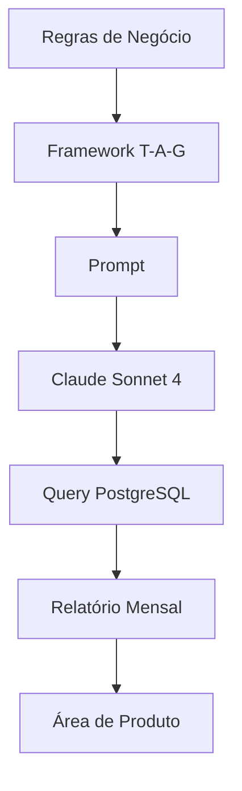

# Questão 04 – Relatório Mensal de Transações do Ledger

## Objetivo

Esta atividade teve como objetivo aplicar o framework **T-A-G (Task – Action – Goal)** para orientar um Modelo de Linguagem (LLM) na construção de uma consulta SQL PostgreSQL capaz de gerar um relatório mensal consolidado das transações do sistema **Ledger**.

Diferentemente das atividades anteriores, o desafio concentrou-se na elaboração de uma consulta analítica, considerando regras de negócio, agregações, filtros temporais e formatação adequada para apresentação executiva.

---

# Cenário

A empresa fictícia **Hill Valley Tech** precisava disponibilizar para a área de Produto um relatório mensal consolidado contendo informações sobre as transações realizadas pelos clientes.

O relatório deveria considerar apenas transações concluídas e apresentar informações agrupadas por mês e categoria, permitindo o acompanhamento da evolução financeira da plataforma. :contentReference[oaicite:0]{index=0}

---

# Framework Utilizado

## T-A-G

```text
Task

↓

Action

↓

Goal
```

### Justificativa

O framework **T-A-G** foi escolhido por estruturar claramente o problema em três etapas:

- definição da tarefa;
- sequência lógica das ações;
- objetivo esperado.

Essa organização mostrou-se adequada para problemas que exigem raciocínio analítico e construção de consultas SQL baseadas em regras de negócio.

---

# Modelo Utilizado

**Claude Sonnet 4**

### Motivo da escolha

O modelo foi selecionado devido à sua elevada capacidade para:

- geração de consultas SQL;
- interpretação de regras de negócio;
- utilização de funções do PostgreSQL;
- criação de consultas analíticas;
- produção de código legível e organizado. :contentReference[oaicite:1]{index=1}

---

# Estrutura da Questão

| Arquivo | Descrição |
|----------|-----------|
| README.md | Visão geral da atividade |
| 01-contexto.md | Contextualização do problema |
| 02-prompt.md | Prompt original |
| 03-modelo.md | Modelo utilizado |
| 04-output.md | Query SQL gerada |
| 05-justificativa.md | Justificativa do framework |
| 06-melhorias.md | Sugestões de evolução |
| 07-conclusao.md | Conclusão da atividade |

---

# Fluxo da Solução



---

# Resultado Esperado

Ao final da atividade espera-se obter uma consulta SQL capaz de:

- filtrar apenas transações concluídas;
- considerar o período correto;
- agrupar os dados por mês e categoria;
- calcular quantidade de transações;
- calcular o volume financeiro;
- apresentar a saída formatada para utilização em relatórios executivos.

---

# Conclusão

Esta atividade demonstra como a Engenharia de Prompt pode ser aplicada na geração de consultas SQL complexas, reduzindo ambiguidades e aumentando a aderência às regras de negócio.

---

## 🔗 Navegação

- 📑 [SUMÁRIO](../SUMMARY.md)
- 🏠 [README do Projeto](../README.md)
- ➡️ [Próxima questão](../questao-04/01-contexto.md)

---
