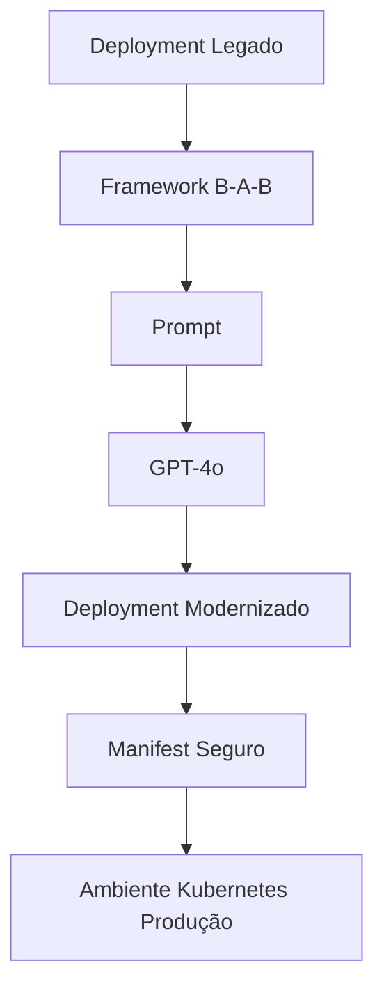

# Questão 05 – Modernização de um Deployment Kubernetes Legado

## Objetivo

Esta atividade teve como objetivo aplicar o framework **B-A-B (Before – After – Bridge)** para orientar um Modelo de Linguagem (LLM) na modernização de um Deployment Kubernetes legado, tornando-o aderente às boas práticas utilizadas em ambientes corporativos modernos.

O desafio consistiu em transformar um manifesto contendo diversas vulnerabilidades e limitações operacionais em uma configuração segura, resiliente e preparada para ambientes Kubernetes 1.30+.

---

# Cenário

A empresa fictícia **Hill Valley Tech** possui uma aplicação denominada **Chronos API**, executando em ambiente Kubernetes.

O Deployment atualmente em produção apresenta diversas inadequações relacionadas à disponibilidade, segurança, gerenciamento de recursos e operação contínua.

O objetivo consiste em refatorar completamente esse Deployment utilizando as recomendações atuais da comunidade Kubernetes e práticas adotadas em ambientes corporativos. :contentReference[oaicite:0]{index=0}

---

# Framework Utilizado

## B-A-B

```text
Before

↓

After

↓

Bridge
```

### Justificativa

O framework **B-A-B** é especialmente indicado para problemas de transformação.

Sua estrutura descreve claramente:

- estado atual;
- estado desejado;
- caminho necessário para realizar a transição.

Essa abordagem facilita tarefas de modernização de infraestrutura, refatoração de código e evolução arquitetural.

---

# Modelo Utilizado

**GPT-4o**

### Motivo da escolha

O modelo foi selecionado devido à sua elevada capacidade para:

- geração de manifests Kubernetes;
- aplicação de boas práticas;
- interpretação de requisitos técnicos;
- segurança de containers;
- modernização de workloads.

Segundo a atividade, o GPT-4o apresentou excelente desempenho na refatoração de manifests Kubernetes e na aplicação consistente de padrões modernos de segurança e operação. :contentReference[oaicite:1]{index=1}

---

# Estrutura da Questão

| Arquivo | Descrição |
|----------|-----------|
| README.md | Visão geral da atividade |
| 01-contexto.md | Contextualização do problema |
| 02-prompt.md | Prompt original |
| 03-modelo.md | Modelo utilizado |
| 04-output.md | Manifest gerado |
| 05-justificativa.md | Justificativa do framework |
| 06-melhorias.md | Sugestões de evolução |
| 07-conclusao.md | Conclusão da atividade |

---

# Fluxo da Solução



---

# Resultado Esperado

Ao final da atividade espera-se obter um Deployment contendo:

- alta disponibilidade;
- imagem versionada;
- gerenciamento seguro de segredos;
- requests e limits;
- probes;
- SecurityContext;
- execução como usuário não-root;
- RollingUpdate;
- aderência às boas práticas do Kubernetes.

---

# Conclusão

Esta atividade demonstra como a Engenharia de Prompt pode auxiliar na modernização de workloads Kubernetes, reduzindo vulnerabilidades e aumentando a confiabilidade operacional.

---

## 🔗 Navegação

- ⬅️ Questão anterior
- 🏠 [README Principal](../README.md)
- ➡️ Próxima questão
