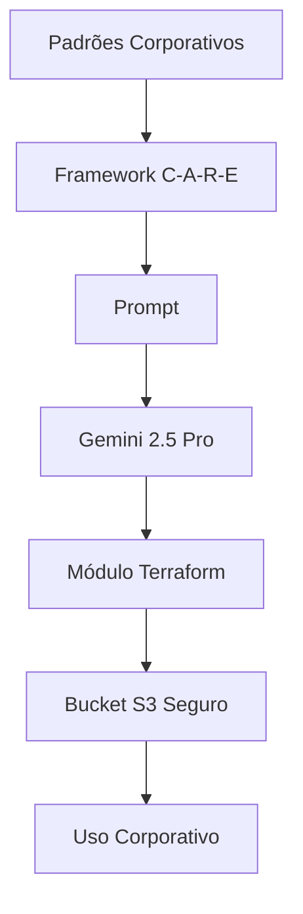

# Questão 06 – Módulo Terraform no Padrão Corporativo

## Objetivo

Esta atividade teve como objetivo aplicar o framework **C-A-R-E (Context – Action – Result – Example)** para orientar um Modelo de Linguagem (LLM) na construção de um módulo Terraform reutilizável para criação de buckets Amazon S3, seguindo integralmente os padrões corporativos da Hill Valley Tech.

O desafio consistiu em gerar uma estrutura de Infrastructure as Code (IaC) aderente aos requisitos de segurança, compliance, padronização e reutilização definidos pela organização.

---

# Cenário

A Hill Valley Tech estabeleceu um conjunto de padrões obrigatórios para todos os módulos Terraform utilizados internamente.

Entre esses padrões destacam-se:

- utilização obrigatória de tags corporativas;
- padronização da nomenclatura dos recursos;
- configuração de segurança para buckets S3;
- documentação completa das variáveis;
- reutilização entre diferentes equipes.

O objetivo era construir um módulo pronto para utilização em ambientes produtivos, mantendo consistência com os padrões internos da empresa.

---

# Framework Utilizado

## C-A-R-E

```text
Context

↓

Action

↓

Result

↓

Example
```

### Justificativa

O framework **C-A-R-E** foi escolhido por permitir fornecer ao modelo todas as informações necessárias para compreender o contexto organizacional antes da geração do código.

Cada componente possui um papel específico:

- **Context** define o ambiente e as regras corporativas;
- **Action** descreve exatamente o que deve ser desenvolvido;
- **Result** estabelece o resultado esperado;
- **Example** apresenta um padrão de implementação que serve como referência.

Essa estrutura reduz ambiguidades e aumenta significativamente a aderência da solução aos padrões internos.

---

# Modelo Utilizado

**Gemini 2.5 Pro**

### Motivo da escolha

O modelo foi selecionado devido à sua elevada capacidade para:

- geração de módulos Terraform;
- organização de projetos IaC;
- interpretação de requisitos corporativos;
- padronização de código;
- aplicação de boas práticas de infraestrutura.

Segundo a atividade, o Gemini 2.5 Pro apresentou excelente desempenho na geração de código Terraform modular e aderente aos padrões definidos.

---

# Estrutura da Questão

| Arquivo | Descrição |
|----------|-----------|
| README.md | Visão geral da atividade |
| 01-contexto.md | Contextualização do problema |
| 02-prompt.md | Prompt utilizado |
| 03-modelo.md | Modelo empregado |
| 04-output.md | Módulo Terraform produzido |
| 05-justificativa.md | Justificativa do framework |
| 06-melhorias.md | Sugestões de evolução |
| 07-conclusao.md | Conclusão da atividade |

---

# Fluxo da Solução



---

# Resultado Esperado

Ao final da atividade espera-se obter um módulo Terraform contendo:

- estrutura reutilizável;
- variáveis documentadas;
- criptografia SSE-S3;
- versionamento habilitado;
- bloqueio completo de acesso público;
- logging configurado;
- padronização de nomenclatura;
- conformidade com os requisitos corporativos.

---

# Conclusão

Esta atividade demonstra como a Engenharia de Prompt pode auxiliar na criação de módulos Terraform padronizados, promovendo maior reutilização, segurança e conformidade em ambientes corporativos.

---

## 🔗 Navegação

- ⬅️ Questão anterior
- 🏠 [README Principal](../README.md)
- ➡️ Próxima questão
