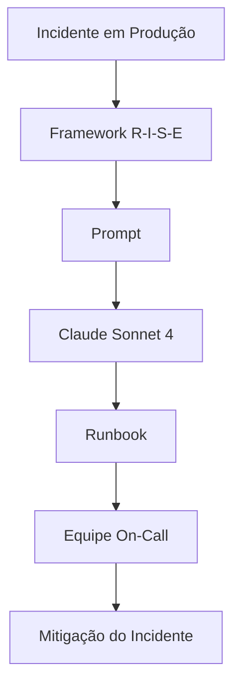

# Questão 07 – Runbook Operacional para Incidentes em Kubernetes

## Objetivo

Esta atividade teve como objetivo aplicar o framework **R-I-S-E (Role – Input – Steps – Expectation)** para orientar um Modelo de Linguagem (LLM) na elaboração de um runbook operacional destinado ao tratamento de alertas recorrentes de alto consumo de memória em uma aplicação executando em Kubernetes.

O desafio consistiu em produzir um documento operacional estruturado, contendo procedimentos claros, comandos executáveis e critérios objetivos para diagnóstico, mitigação, escalação e encerramento de incidentes em ambiente de produção.

---

# Cenário

A empresa fictícia **Hill Valley Tech** mantém a aplicação **Chronos API** executando em um cluster Amazon EKS.

Foi identificado um alerta recorrente relacionado ao consumo elevado de memória dos Pods da aplicação, exigindo a criação de um runbook padronizado para utilização pela equipe de plantão.

O documento deveria permitir que qualquer analista executasse o procedimento com segurança, seguindo uma sequência operacional previamente definida.

---

# Framework Utilizado

## R-I-S-E

```text
Role

↓

Input

↓

Steps

↓

Expectation
```

### Justificativa

O framework **R-I-S-E** mostrou-se especialmente adequado para elaboração de procedimentos operacionais.

Sua estrutura permite definir:

- o papel assumido pelo modelo;
- todas as informações do ambiente;
- a sequência operacional;
- o resultado esperado.

Essa organização reduz ambiguidades e produz documentação padronizada e reutilizável.

---

# Modelo Utilizado

**Claude Sonnet 4**

### Motivo da escolha

O modelo foi selecionado devido à sua elevada capacidade na produção de documentação técnica estruturada, especialmente:

- runbooks;
- procedimentos operacionais;
- documentação SRE;
- incident response;
- documentação DevOps.

---

# Estrutura da Questão

| Arquivo | Descrição |
|----------|-----------|
| README.md | Visão geral da atividade |
| 01-contexto.md | Contextualização do problema |
| 02-prompt.md | Prompt utilizado |
| 03-modelo.md | Modelo empregado |
| 04-output.md | Runbook produzido |
| 05-justificativa.md | Justificativa do framework |
| 06-melhorias.md | Sugestões de evolução |
| 07-conclusao.md | Conclusão da atividade |

---

# Fluxo da Solução



---

# Resultado Esperado

Ao final da atividade espera-se obter um runbook contendo:

- objetivo;
- pré-requisitos;
- comandos executáveis;
- critérios de decisão;
- critérios de escalação;
- critérios de encerramento;
- comunicação do incidente;
- documentação pronta para utilização em produção.

---

# Conclusão

Esta atividade demonstra como a Engenharia de Prompt pode auxiliar na criação de documentação operacional padronizada, aumentando a velocidade de resposta e reduzindo erros durante incidentes em produção.

---

## 🔗 Navegação

- 📑 [SUMÁRIO](../SUMMARY.md)
- 🏠 [README do Projeto](../README.md)
- ➡️ [Próxima questão](../questao-07/01-contexto.md)

---
