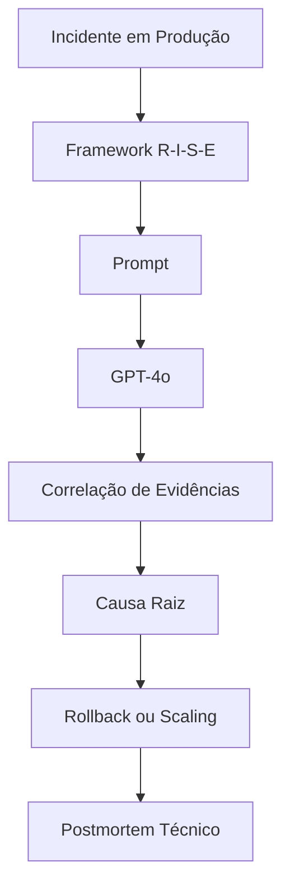

# Questão 08 – Postmortem Técnico de Incidente em Produção

## Objetivo

Esta atividade teve como objetivo aplicar o framework **R-I-S-E (Role – Input – Steps – Expectation)** para orientar um Modelo de Linguagem (LLM) na elaboração de um postmortem técnico preliminar referente a um incidente crítico ocorrido em ambiente de produção.

O desafio consistiu em analisar múltiplas evidências provenientes de métricas, logs, alterações de software e infraestrutura, produzindo uma recomendação técnica capaz de apoiar a tomada de decisão entre executar um rollback da aplicação ou realizar um escalonamento emergencial da infraestrutura.

---

# Cenário

A empresa fictícia **Hill Valley Tech** identificou degradação significativa da aplicação **Chronos API** durante um pico de utilização.

O incidente ocorreu após a implantação da versão **v2.48.0**, que introduziu alterações no gerenciamento do pool de conexões com o banco de dados PostgreSQL.

Durante a investigação foram disponibilizados diversos artefatos técnicos contendo informações sobre:

- deploy realizado;
- métricas da aplicação;
- logs;
- estado do cluster Kubernetes;
- utilização do banco de dados;
- estado das filas de processamento.

Esses elementos deveriam ser correlacionados para apoiar uma decisão operacional urgente.

---

# Framework Utilizado

## R-I-S-E

```text
Role

↓

Input

↓

Steps

↓

Expectation
```

### Justificativa

O framework **R-I-S-E** mostrou-se especialmente adequado para cenários de investigação operacional.

Sua estrutura permite fornecer ao modelo:

- um papel especializado;
- informações completas do incidente;
- uma sequência lógica de investigação;
- um formato claramente definido para o resultado.

Essa abordagem facilita análises complexas envolvendo múltiplas fontes de evidência.

---

# Modelo Utilizado

**GPT-4o**

### Motivo da escolha

O modelo foi selecionado devido à sua elevada capacidade para:

- correlacionar eventos;
- interpretar logs;
- analisar métricas;
- identificar possíveis causas raiz;
- produzir documentação técnica estruturada.

---

# Estrutura da Questão

| Arquivo | Descrição |
|----------|-----------|
| README.md | Visão geral da atividade |
| 01-contexto.md | Contextualização do problema |
| 02-prompt.md | Prompt utilizado |
| 03-modelo.md | Modelo empregado |
| 04-output.md | Postmortem produzido |
| 05-justificativa.md | Justificativa do framework |
| 06-melhorias.md | Sugestões de evolução |
| 07-conclusao.md | Conclusão da atividade |

---

# Fluxo da Solução



---

# Resultado Esperado

Ao final da atividade espera-se obter um postmortem contendo:

- resumo executivo;
- linha do tempo;
- evidências;
- hipóteses;
- análise de causa raiz;
- decisão recomendada;
- nível de confiança;
- próximos passos;
- ações preventivas.

---

# Conclusão

Esta atividade demonstra como a Engenharia de Prompt pode apoiar investigações técnicas complexas, permitindo correlacionar diferentes fontes de informação para produzir recomendações estruturadas e apoiar decisões críticas em ambientes de produção.

---

## 🔗 Navegação

- ⬅️ Questão anterior
- 🏠 [README Principal](../README.md)
- ➡️ Próxima questão
